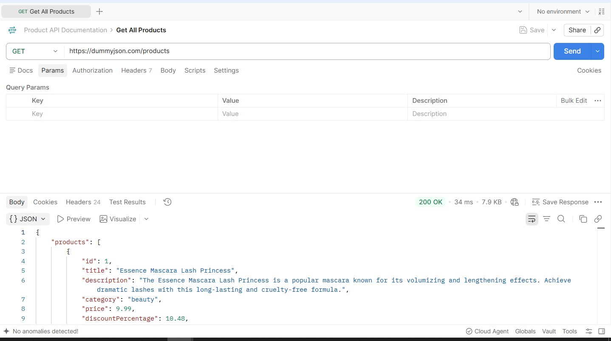

# Postaman Testing

## Overview

This document describes how the Product API was tested using postman.
The tests were performed to verify that the endpoints return the expected for common operations such as retrieving,searching,creating,updating and deleting products.
The test also includes valid and invalid inputs to observe how API behaves in different scenarios.


## Testing Tool

**Tool**: Postman

Postman was used to send HTTP requests to the  API to inspect the responses returned by the server.


## API Base URL

```text
https://dummyjson.com
```


## Test Coverage

Following endpoints were tested

|Method| Endpoint| Test|
|---|---|---|
|GET|`/products`| Retrieve all products|
|GET|`/products/{id}`| Retrieve a specific product|
|GET|`/products/search`| search for products|
|POST|`/products/add`| create a product|
|PUT|`/products/{id}`|update a product|
|DELETE|`/products/{id}`| Deletes the product|


## Postman Collection

The endpoints were organized into a Postman collection for easier testing and management.
The collection contains requests for each API operation:

- Get All Products
- Get Product
- Search Products
- Add Product
- Update Product
- Delete Product

Each request was tested individually and the returned response was reviewed for status code, response structure, and expected data.


## Test 1: Get All Products

### Test Objective

Verify that the API successfully returns a list of products.

### Request

```text
GET https://dummyjson.com/products
```


### Test Steps

1. Open the postman collection.
2. Select **Get All Products**.
3. Verify that the request method is `GET`.
4. Verify the request URL.
5. Click **Send**.
6. Review the response status and response body.


### Expected Result

The API should return:
- A `200 OK` status code.
- A JSON response containing a `products` list.
- A product information such as id,title, category and price.


### Actual Result

The API returned a `200 OK` response and a list of products.


### Result

**Pass**

The request returned a `200 OK` response and a JSON response containing product data.




## Get Product By ID

### Endpoint

```text
GET https://dummyjson.com/products/1
```

### Test Steps

1. Open Postman.
2. Select `GET` method.
3. Enter the endpoint URL.
4. Click **Send**.
5. Verify that the response contains the product with ID `1`.

### Expected Result

The API should return a successful `200 OK` response containing the detail of the requested product.

### Actual result

The API returned a `200 OK` response containing a detail of the the product ID `1`, including its title, description, category, price, stock, rating and other product information.

### Screenshot


